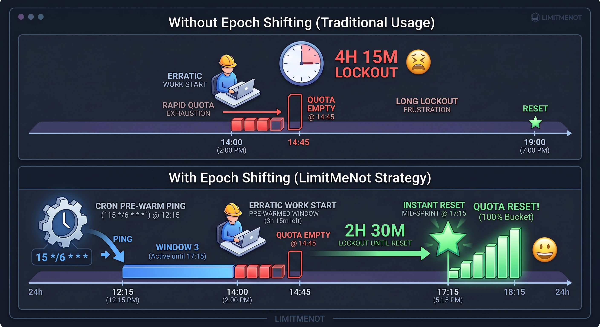

# LimitMeNot: Epoch Shifting

> A timing strategy for rolling 5-hour quota windows on consumer web sessions.



## Overview

**Epoch shifting** is a timing strategy designed to optimize rolling 5-hour quota windows on consumer web sessions. By strategically pre-warming the session with a zero-cost automated ping (for example, using a lightweight model like Haiku), you shift the start time — the **epoch** — of the quota window.

The goal is to create a predictable mid-session reset during an unpredictable work schedule, increasing the amount of usable quota available during a focused development sprint.

## The Problem: The Rolling Window Trap

If an application enforces a 5-hour quota that begins on your **first interaction**, an erratic work schedule works against you.

For example, if you sit down at **2:00 PM** and trigger the window manually, you are bound to a rigid 5-hour countdown. If you exhaust your quota by **2:45 PM**, you may face several hours before the next reset.

Continuous hourly background pings such as:

```cron
0 * * * *
```

are not aligned with a 5-hour quota window. Because 24 hours is not divisible by 5, the relationship between the schedule and quota epochs drifts across the day.

## The Solution: Staggered 6-Hour Cron

A simple static schedule is:

```cron
15 */6 * * *
```

This runs four times per day:

- **00:15**
- **06:15**
- **12:15**
- **18:15**

The 6-hour cadence divides evenly into a 24-hour day, so the schedule remains fixed rather than drifting across midnight.

## Architecture & Reasoning

| Mechanism | Engineering benefit |
|---|---|
| **Staggered execution (`15`)** | Places the trigger away from common `:00` schedules and provides a simple, deterministic offset. It does not guarantee avoidance of provider queueing or race conditions. |
| **6-hour modulo (`*/6`)** | `6` divides evenly into `24`, keeping the schedule static every day. |
| **Four daily pre-warms** | Creates recurring 5-hour windows with 1-hour gaps between them. |
| **Predictable epochs** | A user can estimate when a currently active window will expire without relying on when they happened to start working. |

### Important qualification

This strategy depends on the service actually starting or associating its quota window with the pre-warming interaction. A provider may instead use server-side fixed windows, account-level rate limiting, token budgets, rolling request counters, or anti-abuse controls that do not behave this way.

**Therefore, this is an observed/experimental client-side timing strategy, not a guarantee that any specific provider will reset quota as described.**

## Daily Lifecycle

When the schedule aligns with a 5-hour rolling quota window, the intended daily structure is:

| Period | Status |
|---|---|
| **00:15 – 05:15** | Window 1 active |
| **05:15 – 06:15** | Cooldown / transition |
| **06:15 – 11:15** | Window 2 active |
| **11:15 – 12:15** | Cooldown / transition |
| **12:15 – 17:15** | Window 3 active |
| **17:15 – 18:15** | Cooldown / transition |
| **18:15 – 23:15** | Window 4 active |
| **23:15 – 00:15** | Cooldown / transition |

## Example Scenario

Suppose you start a heavy development sprint at **2:30 PM**.

With the intended schedule, you are already inside the **12:15 PM – 5:15 PM** window. If your quota is tied to that epoch, the next reset occurs at approximately **5:15 PM**, while you are still working.

That creates a fresh 5-hour runway without requiring you to start the sprint at exactly the same time every day.

## Setup

Run the lightweight pre-warming action from a scheduler that you control. The exact command depends on the service and client you are using.

For a standard cron installation:

```cron
# Pre-warm at 00:15, 06:15, 12:15, and 18:15 every day
15 */6 * * * /path/to/your/prewarm-command
```

Before using this approach in production, verify the provider's terms, automation rules, and rate-limit behavior. Some consumer services may prohibit scripted interaction or may change their quota implementation without notice.

## Why Not Hourly?

An hourly schedule:

```cron
0 * * * *
```

produces 24 executions per day and does not synchronize with a 5-hour quota boundary. The resulting relationship between the pre-warm schedule and the quota window changes over time.

The 6-hour schedule is attractive because it gives a fixed daily cadence while keeping the trigger frequency relatively low.

## Operational Guidance

This technique is best treated as a **tactical workaround for interactive consumer-session limits**, not as a substitute for capacity planning.

For sustained development workloads, a cleaner architecture is to route heavy, repetitive, or automated workloads through a direct API or another appropriately provisioned service, while reserving rate-limited web sessions for interactive work.

## Limitations & Risks

- The service may not start a quota window on the pre-warm interaction.
- Quotas may be enforced independently of session epochs.
- Provider-side anti-abuse systems may detect scripted traffic.
- Terms of service may restrict automated interaction.
- Queueing, network latency, retries, and scheduler jitter can move the effective trigger time.
- A lightweight request may still consume some quota, depending on provider behavior.

## Contributing

Issues and pull requests are welcome. Useful contributions include:

- Reproducing the timing behavior across providers.
- Measuring actual epoch and reset times.
- Comparing cron, systemd timers, and managed schedulers.
- Documenting provider-specific behavior.
- Building a small simulator for rolling-window scheduling.

## License

Choose and add a license before publishing derivative implementations.
